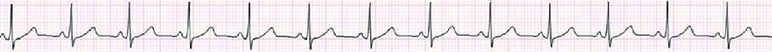
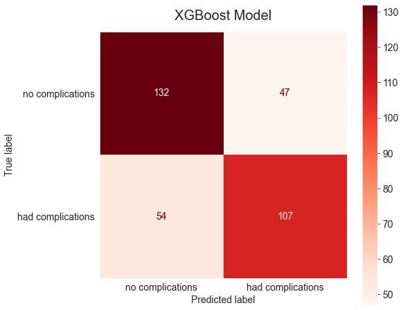
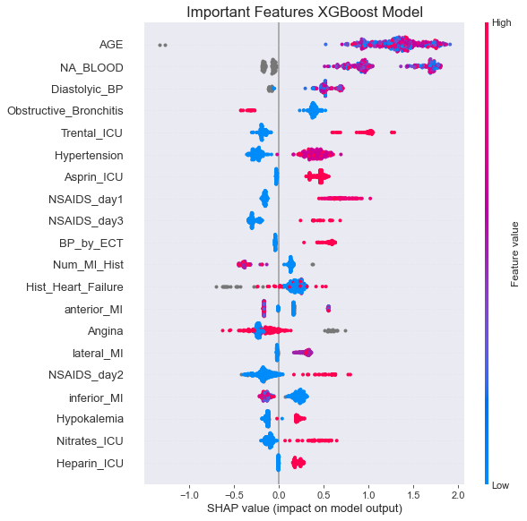

# HeartAttackComplications

## Overview
Despite improvements in our ability to treat heart disease and myocardial infarctions (MIs), hundreds of thousands of Americans die of acute MIs every year. Every  29  seconds,  one  person  becomes  ill  with  MI,  and every minute one patient with MI dies. The first year after having an MI is the most dangerous period for relapse and developing complications. In this time period, more than half of patients will develop some complications and about 15\% will die of heart related issues. 

## Business Problem
Cardiologists at a research hospital would like to decrease the number of patients who die or have potentially fatal complications in the first year after an MI. They would like to both study the causes of these complications and identify patients who are most at risk to be targeted for more intensive follow up care. The goal of this project is to create an algorithm that will predict which patients are most likely to have complication. I will also analyze the model to find potential areas for future research. 

## Data
A cleaned up version of the Myocardial Infarction Complications dataset was obtained from [Kaggle](https://www.kaggle.com/rafatashrafjoy/myocardial-infarction-complications). It contains health data obtained at admission and over 3 days in the Intensive Care unit for 1700 patients who had MIs in Krasnoyarsk, Russia from 1992-1995. The data include age, sex, heart, lung & endocrine issues in a patient's anamnesis (patient's recollection of their health history), results of electrocardiograms and blood work at various points, and medicines given. There are 111 input features. There are also 12 possible target columns that cover various complications, including death, in the first year following the initial MI. A full description of this dataset is available [here](https://leicester.figshare.com/articles/dataset/Myocardial_infarction_complications_Database/12045261/3).

## Method
I tested several types of classification models to see which would best predict whether a patient would experience complications. I also looked at the feature importances of the models to see which features are best predictors of future complications and might be interesting areas of study into why complications occur.

## Results
Of the models tested, the XGBoost model had the best performance to predict future complications, but it had only a 0.66 recall score and 0.68 f1 score on test data, making it unsuitable to use in a clinical setting. it would miss approximately a third of patients who would go on to have complications as well as flag almost as many who don't have complications.

I used a couple methods to examine feature importance of the models. There was significant overlap in which features had the greatest predictive power. 

## Conclusions
Neither of these tuned models did a great job of eliminating false negatives, missing around a third of patients who would go on to have potentially fatal complications or die in the first year after having an MI. I don't believe that further tuning would improve the predictive value of this model. Instead, I could look at other ways of preprocessing the data including more feature engineering. Additionally, a different type of model might have more of an effect on the model success. This data has been used previously to examine Neural Networks, so that seems like an obvious way to go. 

In examining the features that the various models found to be important in making their predictions, several features stood out. The sodium level in the patient's blood (NA_BLOOD) was very important in all three models. Additionally, receiving NSAIDS (e.g. ibuprofen or Alleve), Asprin or Trental (improves blood flow) in the ICU had predictive value in all models. It could be interesting to study why these drugs are important to predicting future complications, while other medicines in the dataset, like opiods, don't have predictive value. I'm also curiuos as to why having Obstructive Chronic Bronchitis seems to have a protective effect.

